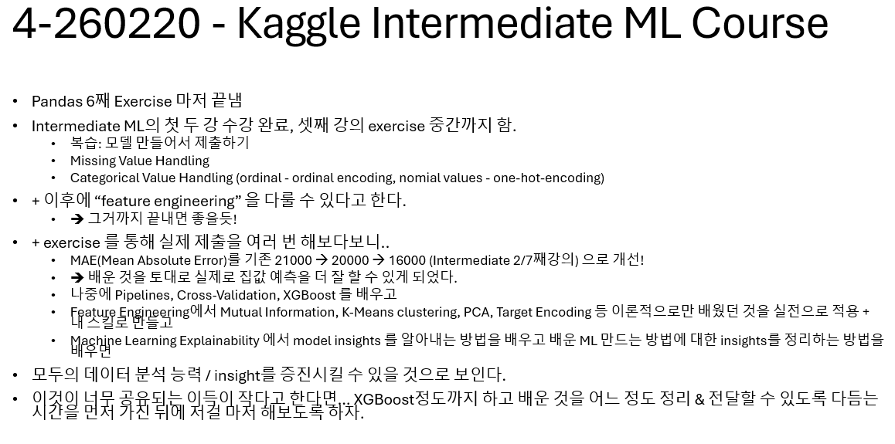

26/02/20(금)

오늘 한 일:

- Pandas 마지막 Exercise까지 완료!
- Intermediate Machine Learning 시작! (7개 강의)
    - 첫 강의에서 마지막 강의 복습이 나왔다. Random Forest로 집값 예측하기였다.
    - Hyperparameter를 변형해보고 chatGPT랑 토의 등등을 하면서 최적의 hyperparameter를 찾아보았다.
    - 그렇게 튜토리얼에서 주어진 feature를 사용해서 Random Forest로 가능한 최적의 hyperparameter setting으로 집값을 예측해보고 Kaggle competition을 제출해볼 수 있었다!
    - https://www.kaggle.com/code/ryanbhang129/exercise-introduction
    - 또한 퀄리티 좋은 데이터를 가져온 사람의 코드를 보고 feature를 하나하나 파악해서 잘 해낸다는 것을 알 수 있었다!
    - 두번째 강의: Missing Value Handling - 이후 MAE 에러를 20000대에서 16000대로 줄일 수 있었다 !
    - 세 번째 강의: categorical value handling 수강 후 exercise 중.

Intermediate ML 에서야 실제 대회랑 exercise를 연동시킴으로써 현실 문제를 어떻게 더 잘 해결할지 고민하고 정말 그럴듯한 solution을 내는 모델을 만들 수 있으며, 이러한 강의가 정말 유익하다는 생각이 든다.

계속 이러한 강의를 수강해서 (Feature Engineering, Reasoning?까지 목표!) 데이터 분석 및 활용능력을 기르고 얻게된 useful insights를 정리하고 공유하도록 하겠다. + 앞으로 계속 배우고 ML 강의를 듣고 사내 해커톤?도 나가보거나 회사에서 ML을 도입해서 해결할 만한 문제를 해결하고자 한다.

앞으로 Intermediate 수강 ==> XGBoost도 사용해보고
Feature Engineering으로 더 최적화?도 시키고 (K-Means Clustering, Mutual Information, Principal Component Analysis 도 나온다고 한다 !!)

https://scikit-learn.org/stable/modules/generated/sklearn.ensemble.RandomForestRegressor.html

- min_samples_split (default is 2) : The minimum number of samples required to split an internal node:
- max_leaf_nodes: (int), default=None Grow trees with max_leaf_nodes in best-first fashion. Best nodes are defined as relative reduction in impurity. If None then unlimited number of leaf nodes.
- n_estimators: (int), default=100 The number of trees in the forest.
- max_features : ({“sqrt”, “log2”, None}, int or float, default=1.0) The number of features to consider when looking for the best split:
    - If int, then consider max_features features at each split.
    - If float, then max_features is a fraction and max(1, int(max_features * n_features_in_)) features are considered at each split.
    - If “sqrt”, then max_features=sqrt(n_features).
    - If “log2”, then max_features=log2(n_features).
    - If None or 1.0, then max_features=n_features.
- min_samples_leaf: int or float, default=1 The minimum number of samples required to be at a leaf node. A split point at any depth will only be considered if it leaves at least min_samples_leaf training samples in each of the left and right branches. This may have the effect of smoothing the model, especially in regression.
    - If int, then consider min_samples_leaf as the minimum number.
    - If float, then min_samples_leaf is a fraction and ceil(min_samples_leaf * n_samples) are the minimum number of samples for each node.
- max_depth(int, default=None): The maximum depth of the tree. If None, then nodes are expanded until all leaves are pure or until all leaves contain less than min_samples_split samples.
