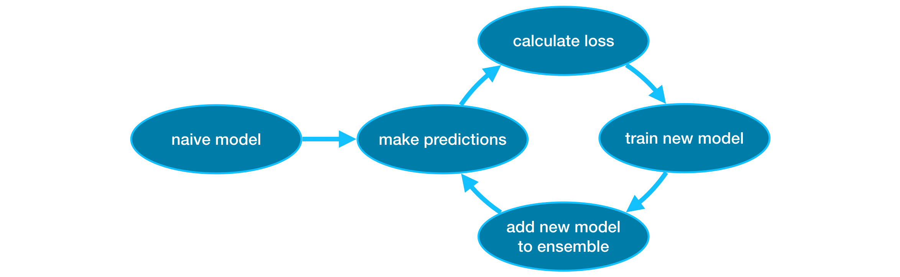

## XGBoost

The most accurate modeling technique for structured data

Use **gradient boosting** to build and optimize models.

This method dominates many Kaggle competitions and achieves state-of-the-art results on a variety of datasets.

### Ensemble Method

An **ensemble method** is a model that combines the predictions of several models. (e.g. random forest: combines predictions of several trees to avg. them.)

### Gradient Boosting

**Gradient Boosting** is a method that goes through cycles to iteratively add models into an ensemble.

It begins by initializing the ensemble with a single model, whose predictions can be pretty naive. (Even if its predictions are wildly inaccurate, subsequent additions to the ensemble will address those errors.) '50% 보다는 조금 높은 predictions'

Iteration Process:

1. Use the current ensemble to generate predictions for each observation in the dataset. (making a prediction : add the predictions from all models in the ensemble.)
2. These predictions are used to calculate a loss function (e.g. mean squared error)
3. Determine model parameters to add to the ensemble by applying the [**gradient** descent](https://en.wikipedia.org/wiki/Gradient_descent) w.r.t. the model parameters.
4. Add the new model to ensemble



**XGBoost** : **extreme gradient boosting**

(an implementation of gradient boosting with several additional features focused on performance and speed - 다른 gradient boosting for scikit-learn도 있긴 하다고 한다.)

scikit-learn API for XGBoost: [xgboost.XGBRegressor](https://xgboost.readthedocs.io/en/latest/python/python_api.html#module-xgboost.sklearn)

`XGBRegressor` class has many tunable parameters !

```py3
from xgboost import XGBRegressor

my_model = XGBRegressor()
my_model.fit(X_train, y_train)

from sklearn.metrics import mean_absolute_error

predictions = my_model.predict(X_valid)
# 241041.5160392121
print("Mean Absolute Error: " + str(mean_absolute_error(predictions, y_valid)))
```

### Parameter Tuning

XGBoost has a few parameters that can dramatically affect accuracy and training speed. Refer [here](https://xgboost.readthedocs.io/en/stable/python/python_api.html#module-xgboost.sklearn) for more information.

- Constructor: XGBRegressor
    - `n_estimators` : Number of gradient boosted trees. Equivalent to number of boosting rounds. (high => overfit. Typically 100-1000, though depends on a lot on `learning_rate`)
    - `learning_rate` (= 0.1 by default): Boosting learning rate (xgb’s “eta”($\eta$))
    - `early_stopping_rounds` (Optional\[int\]): Activates early stopping. Validation metric needs to improve at least once in every `early_stopping_rounds` round(s) to continue training. Requires at least one item in **eval_set** in [`fit()`](https://xgboost.readthedocs.io/en/stable/python/python_api.html#xgboost.XGBClassifier.fit).
    - `n_jobs` (Default: `None` (using **maximum** # cores..!)): On larger datasets where runtime is a consideration, you can use parallelism to build your models faster. It's common to set the parameter `n_jobs` equal to the number of cores on your machine. On smaller datasets, this won't help.

- fit()
    - `eval_set`: A list of (X, y) tuple pairs to use as validation sets, for which metrics will be computed. Validation metrics will help us track the performance of the model.
        - If early stopping occurs, the model will have two additional attributes: `best_score` and `best_iteration`. These are used by the `predict()` and `apply()` methods to determine the optimal number of trees during inference. If users want to access the full model (including trees built after early stopping), they can specify the *iteration_range* in these inference methods. In addition, other utilities like model plotting can also use the entire model.
        - **TIP**: This offers a way to automatically find the ideal value for `n_estimators`. It's NOICE to set a high value for `n_estimators` and then use `early_stopping_rounds` to find the optimal time ('`n_estimators`') to stop iterating.

Example Command

```py3
my_model = XGBRegressor(n_estimators=1000, learning_rate=0.05, n_jobs=4)
my_model.fit(X_train, y_train, 
             early_stopping_rounds=5, 
             eval_set=[(X_valid, y_valid)], 
             verbose=False)
```

Other Stuffs

- `eval_metric` (Union\[str, List\[Union\[str, Callable\]\], Callable, NoneType\]) : Metric used for monitoring the training result and early stopping. string or list of strings as name of predefined metric in XGBoost (See [XGBoost Parameters](https://xgboost.readthedocs.io/en/stable/parameter.html), one of the metrics in [`sklearn.metrics`](https://scikit-learn.org/stable/api/sklearn.metrics.html#module-sklearn.metrics)), or any other user defined metric that looks like *sklearn.metrics*.
- `max_depth` (Optional\[int\]): Maximum tree depth for base learners.
- `callbacks` : List of callback functions that are applied at end of each iteration. It is possible to use predefined callbacks by using [Callback API](https://xgboost.readthedocs.io/en/stable/python/python_api.html#callback-api).
- max_cat_to_onehot (Optional\[int\]) : experimental
- max_cat_threshold (Optional\[int\]) : experimental
- `gamma` (Optional\[float\]) – (min_split_loss) Minimum loss reduction required to make a further partition on a leaf node of the tree.
- `random_state` : Random number seed.
- `missing` (float) – Value in the data which needs to be present as a missing value. Default to `numpy.nan`.
- `importance_type` (Optional\[str\]) : The feature importance type for the feature_importances_ property:
    - For tree model, it’s either “gain”, “weight”, “cover”, “total_gain” or “total_cover”.
    - For linear model, only “weight” is defined and it’s the normalized coefficients without bias.
- `reg_alpha` (Optional\[float\]) – L1 regularization term on weights (xgb’s alpha).
- `reg_lambda` (Optional\[float\]) – L2 regularization term on weights (xgb’s lambda).

Note on Concurrent Execution ( https://xgboost.readthedocs.io/en/stable/python/sklearn_estimator.html )

When working with XGBoost and other sklearn tools, you can specify how many threads you want to use by using the `n_jobs` parameter. By *default*, XGBoost uses **all the available threads on your computer**, which can lead to some interesting consequences when combined with other sklearn functions like [`sklearn.model_selection.cross_validate()`](https://scikit-learn.org/stable/modules/generated/sklearn.model_selection.cross_validate.html#sklearn.model_selection.cross_validate). If both XGBoost and sklearn are set to use all threads, your computer may start to slow down significantly due to something called “thread thrashing”. To avoid this, you can simply set the `n_jobs` parameter for XGBoost to None (which uses all threads) and the `n_jobs` parameter for sklearn to 1. This way, both programs will be able to work together smoothly without causing any unnecessary computer strain.

### Some Score-selecting Tip

- https://scikit-learn.org/stable/modules/model_evaluation.html (뭔가 Which scoring function should I use? 에 대한 디따 유용?한 정보를 담고 있는 것으로 보인다!

some: "most relevant statistical functionals and corresponding strictly consistent scoring functions for tasks in practice" [\[Fissler2022\]](https://arxiv.org/abs/2202.12780)

|functional | scoring or loss function | response `y` | prediction |
| :--- | :--- | :--- | :--- |
| **Classification** | | | |
| mean  |   [squared error (Brier score)](https://scikit-learn.org/stable/modules/model_evaluation.html#brier-score-loss) | multi-class | predict_proba |
| mean  | [log loss](https://scikit-learn.org/stable/modules/model_evaluation.html#log-loss) | multi-class | predict_proba |
| mode | zero-one loss | multi-class | `predict`, categorical |
| **Regression** | | | |
| mean | [squared error](https://scikit-learn.org/stable/modules/model_evaluation.html#mean-squared-error) | all reals | `predict`, all reals |
| mean | [Poisson deviance](https://scikit-learn.org/stable/modules/model_evaluation.html#mean-tweedie-deviance) | non-negative | `predict`, strictly positive |
| mean | [Gamma deviance](https://scikit-learn.org/stable/modules/model_evaluation.html#mean-tweedie-deviance) | strictly positive | `predict`, strictly positive |
| mean | [Tweedie deviance](https://scikit-learn.org/stable/modules/model_evaluation.html#mean-tweedie-deviance) | depends on `power` | `predict`, depends on `power` |
| median | [absolute error](https://scikit-learn.org/stable/modules/model_evaluation.html#mean-absolute-error) | all reals | `predict`, all reals |
| quantile | [pinball loss](https://scikit-learn.org/stable/modules/model_evaluation.html#pinball-loss) | all reals | `predict`, all reals |
| mode | (no consistent one exists) | reals | |

### Insights

직접 변수들을 조정하면서... 항상 전체 모수를 기준으로 생각하며 데이터가 'bias'되어있음을 고려하여 overfitting/underfitting 사이의 균형을 맞추고, 또한 주어진 데이터에만 너무 bias 되지 않도록 모델을 짜야겠다는 생각을 했다.

실제로 XGBoost 다룰땐... 시험삼아 다뤄보는 `early_stopping_rounds` 는 최대한 보수적으로 (default: 5) 높지 않게 설정하는 편이 좋겠다는 생각이 들었다.

learning rate 또한 너무 작지 않게 해야겠다는 생각을 했다. validation score는 높아질지 모르겠지만 너무 낮추면 주어진 데이터에 overfit될 것 같다는 생각을 하게 되었다.


